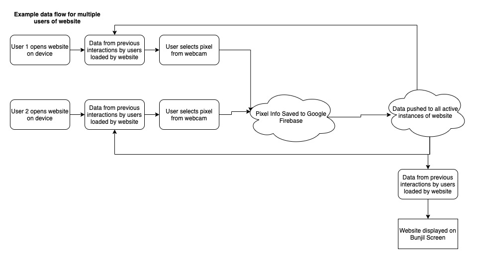

# Realness
 Realness - Bunjil Place Outdoor Screen

 https://code.wesleydowling.com/realness/

## Timeline

https://docs.google.com/spreadsheets/d/1quqKdXNbvNe-xBdyqZVQ92Uwj8ADPTEwRKyobJWrGEw/edit?usp=sharing

## Workflow

Website data workflow

###### Website Elements to develop
Basic shell of site has been completed except sound.

###### Didactics
Artwork title, instructions, artist statement, logos, links to social media & websites.
Basic CSS & html is done - needs to be refined and designed.

###### Particle System - p5js

User selects pixel to upload from webcam image by clicking on screen .  Location of pixel, colour and other data is saved to firebase.  Data is then pushed to any active instances of website.  Pixel then appears and merges with pixels from other users on screen.

Pixel animations grow and fade - uses looping 30 sec approx - pixel interactions will reappear every 30 seconds.
RGB of pixel colour randomized.

May need to restrict particle array count to approx 500 to maintain performance.

###### Camera selection page - not done yet.
Need to design overlay of webcam image to allow user to select pixel.
Might use shader for display.
Need to correct for aspect ratio of different devices.

###### Firebase - google
Holds data from website. Needs to be tested.

###### Sound elements - p5 sound library
Sound effects for touch/click on screen?
background soundtrack/atmospherics
Use same firebase workflow? - upload mic input, push to other devices and process.  Similar to visual workflow.
